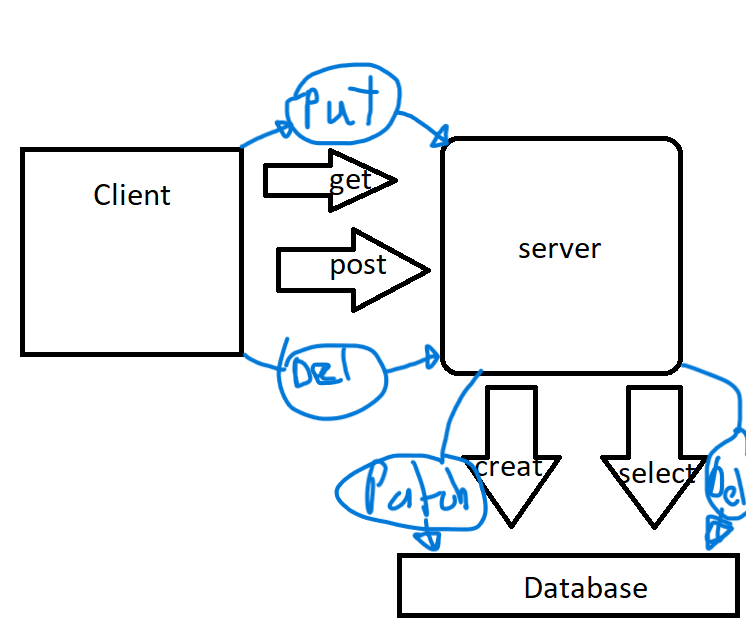

# Movies-Library
# Movies-Library - Project 1

**Author Name**: Laith Saleem Saleem

## WRRC

## Overview
This is a Node.js backend server built with Express and PostgreSQL to provide various endpoints for a movie database web application. The server retrieves movie data from TheMovieDB API using Axios, and it also handles user input to add movies to the database.

The server has several GET  endpoints, including:
     <li>
    returns a JSON object containing a single movie object.
    <li>
    favorite: returns a simple welcome message.
    <li>
    trend: returns an array of objects representing the
    <li> current top trending movies.
    <li>
    search: accepts a search query and returns an array of objects representing the matching movies.
    <li>
    trend/image: returns the image of the first movie in the 
    trending movies list.
    <li>
    trend/overview: returns the overview text of the first
     movie in the trending movies list.

The server also has a POST endpoint, /addmovie, that allows users to add movies to the database by sending a JSON object containing the movie's ID, title, and overview in the request body.

The server connects to a PostgreSQL database using the pg library and handles errors with a custom error handler function. The server is also configured to use dotenv to load environment variables from a .env file.
____________________________
### good way to start a server
## Getting Started
<li>first you want to npm init and install packages(express,cors,axous and dotnev) <li> second you want to link to the movie site using api so you can access data.
<li>third you want to create .env
<li> fourth you have to know how to use get and use async and awake for this axous for this project. 

## Project Features
<li>It has a port number of 3002 or back up of 3001
<li>It can go to home,trend,trendimage and trend overview to display the data from the API.
<li>it is  a private server.
<li>You can navigate to favorites and see a text,you can also access to updated information throwugh trend,trendimage and trendoverview.
<li >You can navigate to djasofj or anywhere that has not been made and get error 404 and it usses try catch method to pinpoint errors.
<li> if there is a error in the workings of the server like a response or a request that is not there you will get error 500 internal error.
<li>Uses get post update and delete to get new data from the client and add it to the database then you can view it there delete it or update it in the database.# serv
