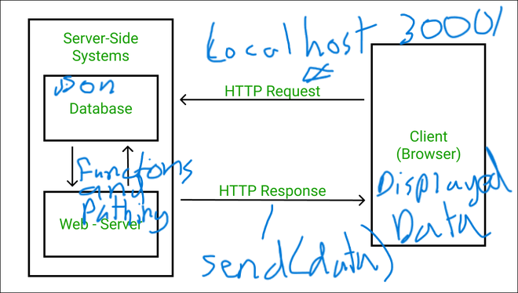

# Movies-Library
# Movies-Library - Project 1

**Author Name**: Laith Saleem Saleem

## WRRC

## Overview
### good way to start a server
## Getting Started
<li>first you want to npm init and install packages <li> second you want to creat movie data file and creat json file and fill it up.
<li>third you want to create server.js and code the server.js
<li> fourth you have to know how to use get and use  for this project. 

## Project Features
<li>It has a port number of 3000
<li>It can go to home and display the data from the json file port.
<li>it is  a private server 
<li>You can navigate to favorites and see a text
<li >You can navigate to djasofj or anywhere that has not been made  and get error 404 
<li> if there is a error in the workings of the server like a response or a request that is not there you will get error 500 internal error